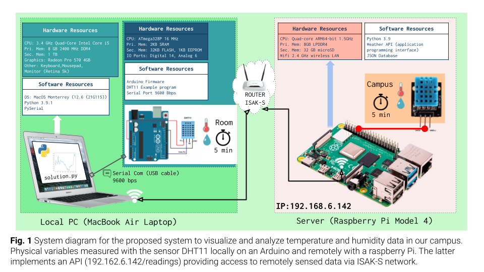

# Unit 2: A Distributed Weather Station for ISAK

## Criteria A: Planning

## Problem definition

## Proposed Solution
**Design statement**


## Success Criteria

1. The solution provides a visual representation of the Humidity and Temperature values inside a dormitory (Local) and outside the house (Remote) for a period of minimum 48 hours.
1. ```[HL]``` The local variables will be measure using a set of 4 sensors around the dormitory.
2. The solution provides a mathematical modelling for the Humidity and Temperature levels for each Local and Remote locations. ```(SL: linear model)```, ```(HL: non-lineal model)```
3. The solution provides a comparative analysis for the Humidity and Temperature levels for each Local and Remote locations including mean, standad deviation, minimum, maximum, and median.
4. ```(SL)```The Local samples are stored in a csv file and ```(HL)``` posted to the remote server.
5. A user manual is provided for the solution.
6. A poster summarizing the visual representations, model and analysis is created and communicated.

# Criteria B: Design

## System Diagram **SL**


**Fig.1** shows the system diagram for the proposed solution (**SL**). The indoor variables will be measured using an Arduino microprocessor and the sensor DHT11 conencted to the local computer (Laptop) located inside a room. The outdoor variables will be requested to the remote server using a GET request to the API of the server at ```192.168.6.147/readings```. The local values are stored in a CSV database locally.


**Fig.2** shows the system diagram for the proposed solution (**HL**). The indoor variables will be measured using a Raspberry PI and four DHT11 sensors located inside a room. Four sensors are used to determine more precisely the physical values and include measurement uncertainty. The outdoor variables will be requested to the remote server using a GET request to the API of the server at ```192.168.6.147/readings```. The local values are stored in a CSV database locally and POST to the server using the API and TOKEN authentication. A laptop computer is used for remotely controlling the local Rasberry Pi using a Dekptop sharing application (VNC Viewer). (Optional) Data from the local raspberry is downloaded to the laptop for analysis and processing.


## Record of Tasks
| Task No | Planned Action                                                | Planned Outcome                                                                                                 | Time estimate | Target completion date | Criterion |
|---------|---------------------------------------------------------------|-----------------------------------------------------------------------------------------------------------------|---------------|------------------------|-----------|
| 1       | Create system diagram                                         | To have a clear idea of the hardware and software requirements for the proposed solution                        | 10min         | Sep 24                 | B         |

## Test Plan

# Criteria C: Development

## List of techniques used

## Development


# Criteria D: Functionality

A 7 min video demonstrating the proposed solution with narration
